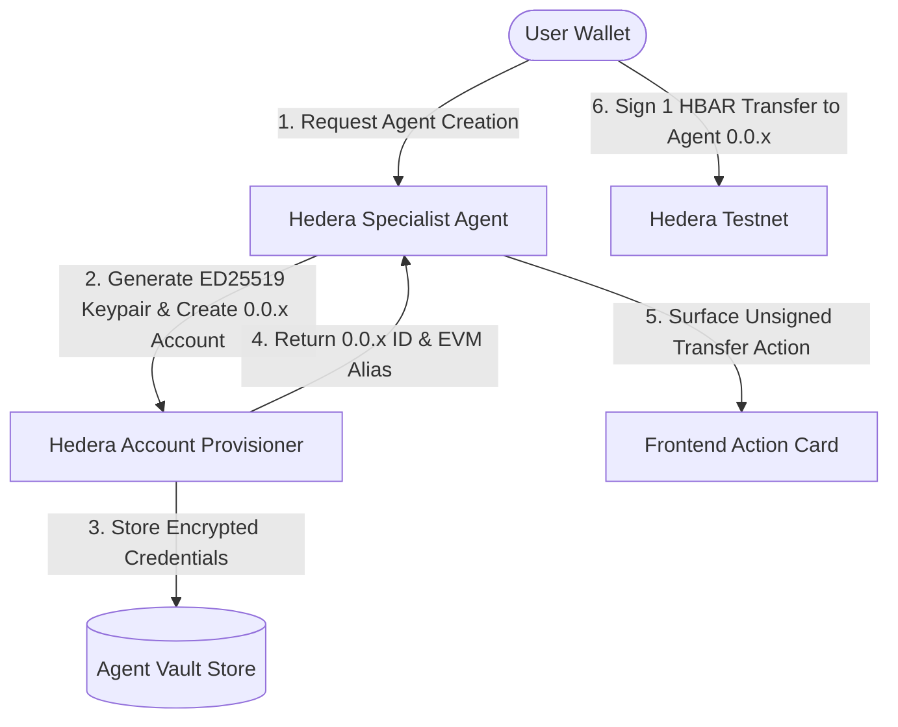
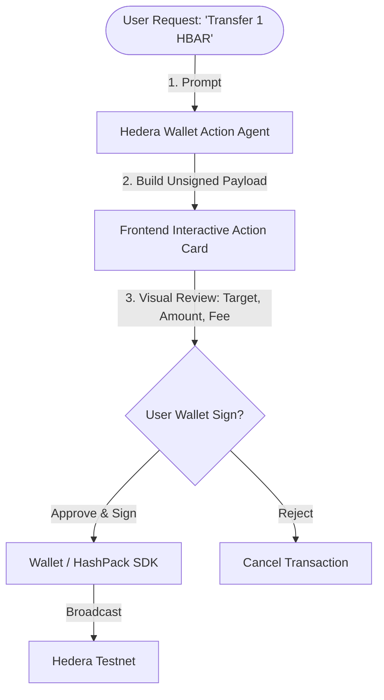

# Agents

ChainScope's reasoning layer is a LangGraph graph with one **orchestrator**
node and several **specialist** nodes. This is the "AI agent component that
reasons over or acts on the data" the bounty requires — specialists don't
just print raw subgraph responses, they interpret, cross-reference, and
summarize them.

## Orchestrator

- Receives the user's message + conversation state.
- Classifies intent and routes to one or more specialists (LangGraph
  conditional edges). Simple questions may hit a single specialist; complex
  ones ("compare my Aave and Compound exposure") can fan out to several and
  merge their outputs.
- Owns the final response synthesis: combines specialist outputs, decides
  what tables/charts to surface, and writes the user-facing answer.

## Specialists

Each specialist is a LangGraph node (its own small ReAct-style loop) scoped
to one domain, with its own system prompt and curated subset of Subgraph
MCP tools (so it queries the right subgraphs instead of guessing across
15,000+).

| Specialist | Domain | Example question | Key subgraphs |
|---|---|---|---|
| Portfolio agent | balances, transfers, swaps across wallets/chains | "What's my PnL on this wallet this month?" | token/transfer subgraphs per chain |
| DeFi research agent | protocol state, liquidity, rates | "What's the current utilization on Aave USDC?" | Aave, Uniswap, Compound subgraphs |
| Risk monitor agent | lending health factors, liquidation proximity | "Am I close to liquidation on my Aave position?" | Aave/Compound position subgraphs |
| Governance agent | DAO proposals, votes | "Summarize active Uniswap governance proposals" | governance subgraphs (Snapshot-style) |
| Yield advisor agent | finds idle wallet assets and proposes a real deposit action | "What should I do with my idle assets?" | Aave v3 Sepolia subgraph (APY) + live RPC balance reads |
| Analyst/visualization agent | takes another agent's data and produces charts/tables via the Python sandbox | "Chart my token balances over the last 90 days" | (consumes prior agents' output) |
| Hedera agent | HBAR balances, HTS tokens/NFTs, transactions, HCS topic messages on Hedera | "What's the HBAR balance of 0.0.1234?" | Hedera Mirror Node REST API (testnet by default) |
| Hedera action agent | executes real Hedera testnet transactions: HBAR transfer, HCS topic create/submit, HTS token create/mint/associate | "Send 5 HBAR to 0.0.1234" | Hedera Agent Kit (Python), AUTONOMOUS mode |

### Yield advisor — acting, not just reporting

Unlike the other specialists, the yield advisor doesn't stop at an answer.
Its tools (`app/tools/aave_actions.py`) are split so the LLM only ever
*picks* an asset/amount — it never generates a contract address or
calldata itself:

1. `check_idle_aave_reserves` — a deterministic tool, not an LLM guess: for
   each of Aave v3 Sepolia's USDC/DAI/LINK/WETH reserves, it reads the
   wallet's underlying-token and aToken balances via a live `eth_call` to a
   public Sepolia RPC. An asset held but with no aToken balance is idle.
2. The agent queries Aave's Sepolia subgraph (via Subgraph MCP) for that
   reserve's current supply APY, so the number in its answer is live.
3. `propose_yield_action` — also deterministic — builds the exact
   `approve()` + `supply()` calldata for the chosen asset/amount against
   Aave v3's official Sepolia Pool contract. This is returned to the
   frontend as an `action/yield-supply` artifact; the user's own wallet
   signs and broadcasts both transactions (see
   [frontend.md](./frontend.md)) — nothing is simulated, but it's testnet
   funds, safe to demo live.

### Hedera action agent — acting, differently than the yield advisor

The Hedera action agent (`app/agents/specialists/hedera_action.py`,
`app/tools/hedera_actions.py`) also acts rather than just reports, but with
a different safety model than the yield advisor:

- The yield advisor only ever *builds* a transaction (`propose_yield_action`)
  for the user's own connected wallet to sign — nothing executes until the
  user approves it.
- The Hedera action agent executes immediately: it's built on the
  [Hedera Agent Kit](https://docs.hedera.com/solutions/ai/agent-kit) (Python)
  in `AgentMode.AUTONOMOUS`, signing and submitting directly against a
  dedicated **backend-held Hedera testnet operator account** — not the
  user's wallet. This is safe specifically because it's testnet HBAR/tokens
  with no real value; the same code must not point at mainnet with a
  funded key.
- The curated tool surface (`HEDERA_ACTION_TOOL_NAMES` in
  `app/tools/hedera_actions.py`) covers HBAR transfer, HCS topic
  create/submit, and HTS token create/mint/associate — narrow on purpose,
  same reasoning as the curated per-specialist subgraph lists in
  [graph-api.md](./graph-api.md).
- Requires `HEDERA_OPERATOR_ACCOUNT_ID`/`HEDERA_OPERATOR_PRIVATE_KEY` (see
  `.env.example`); without them the action agent raises clearly on first
  use rather than silently no-opping. The read-only `hedera` specialist
  works fine without these.
- A second specialist, `hedera_wallet_action` (below), covers the case
  where the *user's own* wallet should sign instead of the backend
  operator, matching the yield advisor's model — see the next section for
  how it splits across wallet types.

### Hedera wallet action agent — two signing paths, kept side by side

`hedera_wallet_action.py` builds transactions for the user's own connected
wallet to sign — the backend never holds the keys or broadcasts. There are
two distinct paths, chosen automatically by which wallet is connected
(`CONNECTED_HEDERA_RE`/`CONNECTED_EVM_RE`), not a user toggle. They aren't a
migration from one to the other — they cover different wallets and
different capability surfaces:

- **HashPack, via HashConnect** (`AgentMode.RETURN_BYTES`, shipped) — native
  Hedera SDK transaction bytes, returned as an `action/hedera-tx-bytes`
  artifact. Covers the full curated tool surface: HBAR transfer, HCS topic
  create/submit, HTS token create/mint/associate. MetaMask cannot sign
  these — it has no concept of a Hedera `TransferTransaction`.
- **MetaMask, via Hedera's JSON-RPC relay** *(planned)* — plain
  `eth_sendTransaction`s, returned as `action/hedera-evm-tx`. Covers native
  HBAR value transfers directly, plus anything Hedera exposes as a System
  Contract precompile at a fixed address — HTS at `0x167`, the Schedule
  Service at `0x16b`. HCS has no System Contract equivalent, so topic
  create/submit stays HashPack-only regardless of which wallet is
  connected.
- If a request needs a HashPack-only capability (e.g. HCS) but only
  MetaMask is connected, the agent should ask the user to connect a
  Hedera-native wallet rather than attempt something MetaMask can't sign.

**Planned**: a recurring/scheduled HBAR transfer (e.g. "send 1 HBAR to X
every hour"), signed entirely through MetaMask via a small deployed
`ScheduledVaultFactory`/`ScheduledVault` contract pair (vendored from
[hedera-dev/scaffold-hbar](https://github.com/hedera-dev/scaffold-hbar)'s
`templates/payments-scheduler`) that self-reschedules using the HSS
precompile (`IHederaScheduleService.scheduleCall`, `0x16b`), returned as a
multi-step `action/hedera-evm-tx-batch` artifact. This one is inherently
MetaMask-only in the other direction — HashConnect has no path to a System
Contract call at all, so it's not offered to HashPack users.

### Managed Hedera Agent Accounts — User-Wallet Provisioning & Funding Architecture

To enable users to deploy and fund personal Hedera agents (e.g. *"Create a Hedera agent tied to my wallet and send 1 HBAR to it"*), Chainscope uses a **Managed Agent Account Vault** model:

#### Agent Storage & Persistence Mechanism:

1. **On-Chain Persistence (Hedera Network)**:
   - The agent's identity and ledger state exist on Hedera Testnet as a native account entity (`0.0.XXXXX`).
   - Account balances, token associations, and transaction histories are immutably stored on the Hedera ledger and publicly queryable via the Hedera Mirror Node API (`/api/v1/accounts/0.0.XXXXX`).

2. **Backend Persistence (Encrypted Vault Store)**:
   - **Database Schema / Store**: Agents are stored in a local SQLite database
     (`app/core/agent_store.py`, path configurable via `managed_agent_db_path`)
     under a `managed_agents` table, one row per `(owner_address, agent_name)`:
     - `id`: Autoincrementing row id.
     - `owner_address`: User's connected wallet address, the key used to look
       up an owner's agents.
     - `agent_name`: User-chosen label for the agent, unique per owner.
     - `account_id`: Hedera account ID (`0.0.XXXXX`).
     - `encrypted_private_key`: Private key encrypted via AES-256-GCM
       (`app/tools/hedera_provisioner.py`).
     - `status`: Lifecycle state, `PENDING` until the seed-funding tx is
       confirmed, then `ACTIVE`.
     - `created_at`: Timestamp.

3. **Session & State Hydration**:
   - When a user interacts with the app, the backend queries `get_user_agents(owner_wallet_address)`.
   - The Hedera Specialist node hydrates its state with the user's active agents, loading credentials into temporary per-request `HederaLangchainToolkit` contexts to execute authorized sub-agent actions securely.

##### Robust Human-in-the-Loop (HITL) Integration Architecture:

To prevent unnecessary chat dialog loops (*"Do you want to use account X as payer? Do you want a memo?"*) while keeping user transactions 100% safe, Chainscope implements a two-tier Human-in-the-Loop (HITL) pattern:

1. **Non-Blocking Intent Resolution (Backend)**:
   - The LLM assumes sensible defaults for implicit parameters (using the user's connected wallet `0.0.XXXXX` as the payer and omitting optional memos).
   - Rather than stopping to ask text questions in chat, the agent immediately invokes the action tool to construct unsigned transaction bytes (`return_bytes`).

2. **Visual Interactive Action Cards (Frontend HITL)**:
   - The payload is returned as a structured UI artifact (`action/hedera-tx-bytes`, `action/yield-supply`, or, once the MetaMask path lands, `action/hedera-evm-tx`/`action/hedera-evm-tx-batch`).
   - The frontend renders an interactive **Action Card** showing full transaction parameters (Sender, Recipient, Amount, Network Fee, Memo).
   - The transaction **never executes automatically** — the user reviews the exact details on-screen and approves or rejects it with 1 click in their connected wallet. Today that's HashPack only for `action/hedera-tx-bytes`; MetaMask support is the planned `action/hedera-evm-tx` path described above, a separate artifact type rather than the same one signed by a different wallet.

Specialists are intentionally narrow — this keeps prompts small, tool
choice accurate, and traces in LangSmith easy to debug per-domain.

## Shared tools

- **Subgraph MCP** — every data-fetching specialist calls out to The
  Graph's Subgraph MCP server rather than hand-rolled GraphQL clients. See
  [graph-api.md](./graph-api.md).
- **Python sandbox** — any specialist (typically routed through the
  analyst agent) can request pandas transforms or chart generation. See
  [python-sandbox.md](./python-sandbox.md).
- **Hedera Mirror Node** — the Hedera agent queries Hedera's public,
  no-auth Mirror Node REST API (`app/tools/hedera_mirror.py`) directly
  rather than via MCP — it's a single small REST surface (accounts,
  tokens, transactions, HCS topics), unlike the 15,000+ subgraphs Subgraph
  MCP exists to discover across. `HEDERA_MIRROR_NODE_BASE_URL` selects
  network (testnet by default; swap to mainnet's base URL for prod data).

## State

LangGraph state carries: conversation history, the current user question,
per-specialist scratch results (raw subgraph responses, dataframe
summaries), and any generated artifact references (chart images, tables)
to attach to the final response.

## Observability

Every node execution, tool call, and LLM completion is traced to LangSmith
under a project per environment (`chainscope-dev`, `chainscope-demo`).
This is what lets us debug which specialist mis-routed or which subgraph
query failed during the live demo.
